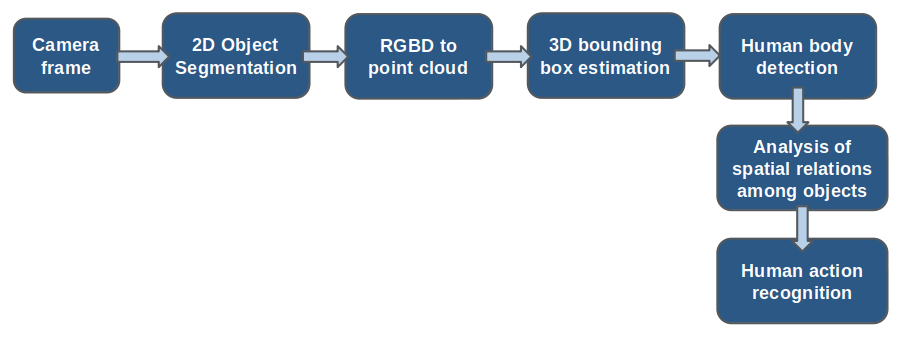

# Deep Learning – based Human Actions Recognition in a Collaborative Robotics Environment
ROS project for the recognition of human actions, from RGBD input
## Overview
This ROS project allows to recognize some human actions performed in a manufacturing environment, from RGB-D input data.
The following image illustrates the pipeline of the project:

Each task is executed by a ROS node, implemented in Python or C++.
Specifically, the ROS nodes responsible for the execution of the pipeline are:
* **mask_rcnn.py**, for 2D object segmentation;
* **pcd_segmentation.py**, for RGBD to point cloud transformation;
* **human_body_detection.py**, for 3D human body detection;
* **recognition.cpp**, for all the remaining steps.

## Input data
The algorithm can take as input any pair of color and depth images, which can be transferred through ROS messages _sensor_msgs/Image_.

The algorithm was tested on the ROS topics: 
- _camera/rgb/image_rect_color_
- _camera/depth_registered/hw_registered/image_rect_raw_

## Main ROS message
The information of each object detected in the scene is stored in a custom ROS message object.msg, hosting the following fields:
* _std_msgs/Header_ **header**, with the header of the input frame;
* _sensor_msgs/Image_ **mask**: an array of pixels with values 0 and 1 representing the seg-
mentation mask of the object;
* _geometry_msgs/Point[]_ **bb_2d**: 2 points (xmin,ymin) and (xmax,ymax) of the bounding
box predicted by the 2D Object Segmentation stage;
* _float64_ **score**: confidence score of the object detection;
* _sensor_msgs/PointCloud2_ **pointcloud**: 3D point cloud of the object, computed by the
node pcd_segmentation.py;
* _label_object_ **label**:
  - _string_ **class_name**: name of the current object class;
  - _uint8_ **id**: id of the object in scene (integer number);
  - _float32[]_ **color**: 3D vector (r, g, b) describing the RGB value for the point cloud of
    the current object, assigned during the instance segmentation.

The information about all the objects in the scene is stored as a custom ROS message called objects_array: 
- _object[]_ **objects**

Each ROS node executes a specific step of the pipeline and updates the fields of a ROS message _objects_array_.

## 2D Object Segmentation
In order to recognize the objects in the scene, the instance segmentation model Mask-RCNN was applied.
This model belongs to the [Tensorflow Object Detection API](https://github.com/tensorflow/models/tree/master/research/object_detection).
All the details about the dataset and the training will be found in another repository on this Github profile.
The first ROS node mask_rcnn.py is responsible for the inference of Mask-RCNN on the RGB input from the camera.
The output produced by this processing unit consists in the instance segmentation annotations for each object in the camera frame (2D bounding boxes, segmentation masks, scores and labels).
The functions used within this node belong to the library .

## RGBD to Point Cloud
The ROS node **pcd_segmentation.py** is in charge of the estimation of a 3D point cloud for each object which was detected in the scene by Mask-RCNN.
The picture below summarizes the statement of the problem which is tackled at this step.

The point cloud is estimated thanks to the depth information from the camera and the output of Mask-RCNN, by applying some functions belonging to the library [Open3D](https://github.com/intel-isl/Open3D).
This unit updates the fields of the main ROS message, by including the coordinates of the 3D points being part of each point cloud.

##3D Bounding Box Estimation
This step is in charge of the estimation of a 3D bounding box around each point cloud.
Specifically, the algorithm estimates oriented bounding boxes, by using the library [PCL](https://github.com/PointCloudLibrary/pcl).
The picture below shows an example of the obtained result.

## 3D Human body detection
A technology for 3D human pose estimation was integrated with the overall project.
This solution was designed by KUKA and it is based on the existing technology [OpenPose](https://github.com/CMU-Perceptual-Computing-Lab/openpose).
This algorithm provides the 3D keypoints of the main human body parts.

## Analysis of the spatial relations among the objects
On the basis of all the information obtain before, the algorithm can identify the fundamental spatial relations among the objects in the scene.
The solution relies on 3D data coming from the human pose estimation task and the 3D bounding boxes of the objects.
For each frame, the relative positions of the objects are evaluated from a geometric point of view, in order to extract relations among each pair of elements.
This solution is based on the paper F. Ziaeetabar, E. E. Aksoy, F. Wörgötter and M. Tamosiunaite, "Semantic analysis of manipulation actions using spatial relations," 2017 IEEE International Conference on Robotics and Automation (ICRA), Singapore, 2017, pp. 4612-4619.

## Human Action Recognition
At this point, once the spatial relations have been computed, the system can classify the action which is being performed in front of the camera, thanks to a sort of state machine implementation.
Within such a state machine, the final state represents the label of the action.

The state machine was manually coded, in order to provide the recognition of the following activities:
1. Placing an object inside a box;
2. Repairing a box with some tape;
3. Repairing a camera with a screwdriver / drill / tape;
4. Working with the computer;
5. Texting with the phone.

The video below shows an example of the system, running.
From left to right:
3D human pose estimation, instance segmentation through Mask-RCNN, 3D point clouds estimation, output of the algorithm (Rgb image of the scene with the label of the current state)

